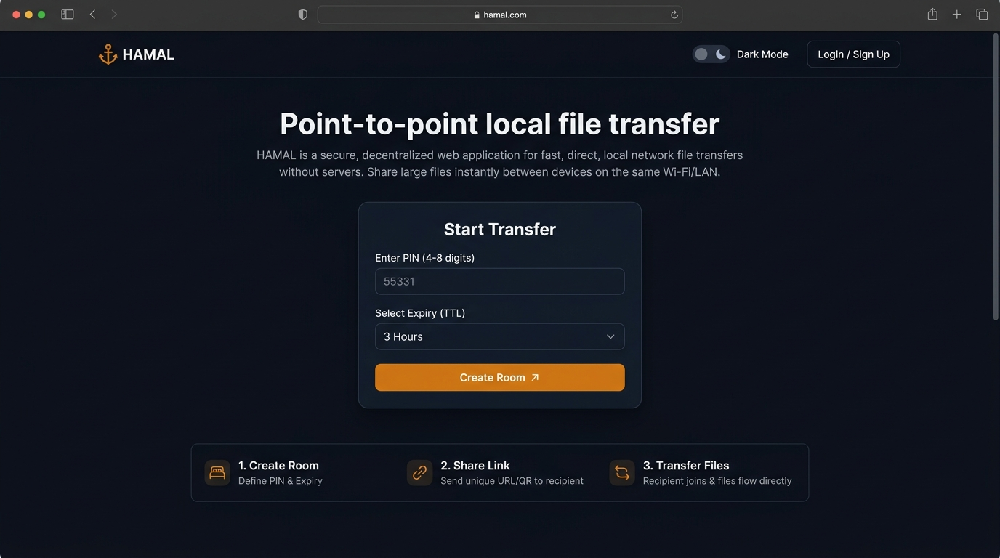
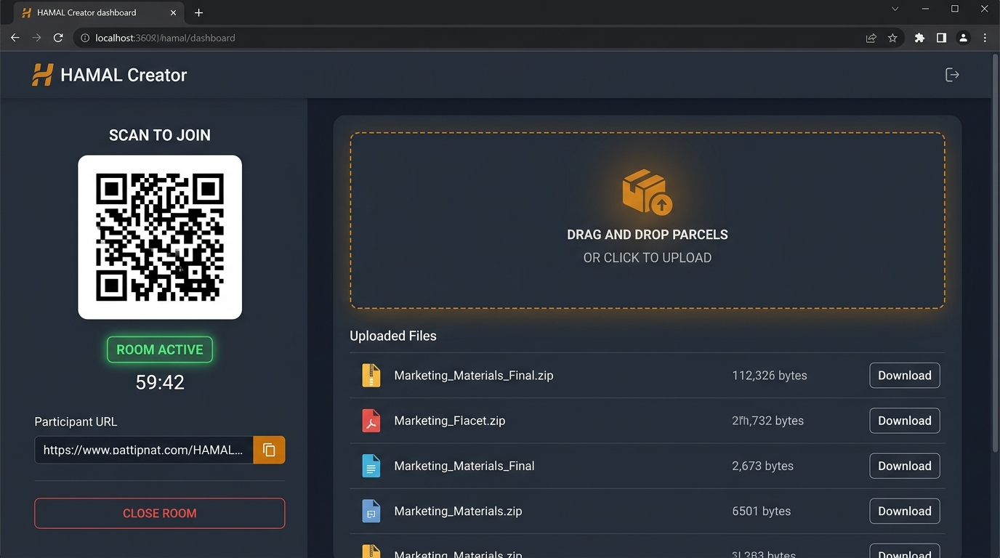

<div align="center">


# HAMAL

**Point-to-point local file transfer. The carrier for your digital cargo.**

[](https://golang.org)
[](Dockerfile)
[](unraid-template.xml)
[](LICENSE)

</div>

---

## What is HAMAL?

**HAMAL** (Turkish for *porter* / *carrier*) is a fast, lightweight, self-hosted web application designed for frictionless, temporary file transfers across your local network (LAN / Wi-Fi).

In traditional culture, a *hamal* carries goods and heavy loads from one place to another. In **HAMAL**, the cargo is digital: files move directly between devices on your local network without intermediate cloud storage, permanent user accounts, advertising, or telemetry.

```
+---------------+                    +----------------+                    +-----------------+
|               |  1. Scans QR Code  |                |  2. Streams File   |                 |
|  Room Creator | -----------------> |  HAMAL Server  | <----------------- |   Participant   |
|   (Desktop)   |                    | (Local Network)|                    | (Mobile/Laptop) |
+---------------+                    +----------------+                    +-----------------+
```

---

## Screenshots

<div align="center">

### Home / Landing Page
*Start temporary transfer rooms with customizable TTL and optional PIN security.*
<br/>


<br/><br/>

### Creator Dispatch Dashboard
*Real-time QR code with instant expansion lightbox, parcel dropzone, countdown timer, and secure file manifests.*
<br/>


</div>

---

## Key Features

- 🚀 **Zero Setup for Participants**: Scan a QR code or open a local link to immediately upload or download files.
- ⏱️ **Auto-Expiring Rooms**: Rooms automatically expire and clean up files after a configurable TTL (5 minutes to 24 hours).
- 🔒 **PIN Protection**: Optional 4–8 digit PIN with exponential backoff and lockout to prevent brute-force attacks.
- 📦 **True Streaming I/O**: Multi-gigabyte transfers stream directly to disk without exhausting server RAM.
- 🎨 **Warm Courier Aesthetics**: Clean, modern interface in dark and light modes with warm amber courier accents.
- 🔍 **Interactive QR Lightbox**: One-click smooth zoom for scanning QR codes from across the room.
- 🛡️ **Self-Hosted & Private**: Zero cloud dependencies, zero external analytics, zero tracking.

---

## Quick Start

### Using Docker Compose (Recommended)

1. Clone the repository:
   ```bash
   git clone https://github.com/i1k3r/HAMAL.git
   cd HAMAL
   ```

2. Copy the sample environment file:
   ```bash
   cp compose.example.env .env
   ```

3. Start the container:
   ```bash
   docker compose up -d
   ```

4. Open your browser and navigate to:
   ```
   http://localhost:7700
   ```

---

### Unraid Installation

1. Place [`unraid-template.xml`](unraid-template.xml) into `/boot/config/plugins/dockerMan/templates-user/` on your Unraid flash drive.
2. Go to the **Docker** tab in Unraid and click **Add Container**.
3. Select **HAMAL** from the template list.
4. Set your preferred web UI port and appdata directory path (`/mnt/user/appdata/hamal`), then click **Apply**.

---

### Manual Binary Build (Go)

Prerequisites: Go 1.22+, GCC / CGO (for SQLite support).

```bash
# Clone the repository
git clone https://github.com/i1k3r/HAMAL.git
cd HAMAL

# Run tests
go test ./...

# Build the executable
go build -o hamal ./cmd/lan-drop

# Run HAMAL
./hamal
```

---

## Configuration

HAMAL is configured via environment variables:

| Variable | Default | Description |
| :--- | :--- | :--- |
| `LAN_DROP_LISTEN_ADDR` | `:7700` | Address and port to bind the HTTP server |
| `LAN_DROP_DATA_DIR` | `/data` | Root directory for SQLite DB, temporary files, and secrets |
| `LAN_DROP_DEFAULT_TTL` | `1h` | Default room lifetime |
| `LAN_DROP_MIN_TTL` | `5m` | Minimum allowed room lifetime |
| `LAN_DROP_MAX_TTL` | `24h` | Maximum allowed room lifetime |
| `LAN_DROP_MAX_FILE_SIZE` | `10737418240` (10 GB) | Maximum size of an individual file |
| `LAN_DROP_MAX_ROOM_SIZE` | `10737418240` (10 GB) | Maximum aggregate file storage per room |
| `LAN_DROP_MAX_FILES_PER_ROOM`| `100` | Maximum number of files per room |
| `LAN_DROP_CLEANUP_INTERVAL` | `1m` | Frequency of background room and orphan file sweeps |
| `LAN_DROP_LOG_FORMAT` | `json` | Log format (`json` or `text`) |
| `LAN_DROP_LOG_LEVEL` | `info` | Log verbosity (`debug`, `info`, `warn`, `error`) |
| `LAN_DROP_SECURE_COOKIES` | `auto` | Cookie security (`auto`, `true`, `false`) |

---

## Brand Assets

Official HAMAL vector logos and icons are available in the [`brand/`](brand/) directory:

- `brand/hamal-logo-dark.svg` (Horizontal dark-mode wordmark)
- `brand/hamal-logo-light.svg` (Horizontal light-mode wordmark)
- `brand/hamal-logo-stacked.svg` (Stacked badge wordmark)
- `brand/hamal-app-icon.svg` (Square container icon)
- `brand/hamal-monochrome.svg` (Monochrome asset)
- `brand/hamal-path-mark.svg` (Vector path symbol)

---

## License

Released under the [MIT License](LICENSE).
